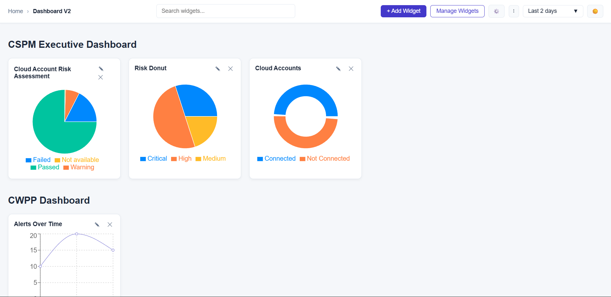

# Dynamic Dashboard Application

This project is a **React + Vite + Redux Toolkit** based dashboard that allows users to dynamically manage widgets across multiple categories.  
The application demonstrates how to build a modular, scalable dashboard with charting features and a polished UI.

---

## ✨ Features

- **Dynamic JSON-driven dashboard**  
  Categories and widgets are generated from a single JSON structure in Redux.

- **Add / Edit / Remove widgets**  
  Users can add new widgets, update existing ones, or remove them directly.

- **Multiple chart types**  
  - Donut chart  
  - Pie chart  
  - Bar chart  
  - Line chart  
  (powered by [Recharts](https://recharts.org))

- **Manage Widgets Modal**  
  Centralized place to toggle widgets on/off per category.

- **Global Search**  
  Search widgets across categories in real-time.

- **Modern Navbar**  
  - Search bar  
  - Add Widget button  
  - Manage Widgets button  
  - Settings & More menus  
  - Time filter dropdown with animations  
  - Theme toggle (Light/Dark mode)

- **Clean UI/UX**  
  - Responsive layout  
  - Smooth animations  
  - Light and dark themes  
  - Consistent styling across all components

---

## 🛠 Tech Stack

- **Frontend Framework:** React 19 (with Vite)  
- **State Management:** Redux Toolkit  
- **Charts:** Recharts  
- **Styling:** Custom CSS with theme variables  
- **Build Tool:** Vite  

---

## 📂 Project Structure

project-root/

│
├── public/ # Static assets

├── src/

│ ├── components/ # UI components (Navbar, Dashboard, Widgets, Modals)

│ ├── store/ # Redux Toolkit slice (dashboardSlice.js)

│ ├── App.jsx # Main application entry

│ ├── main.jsx # Vite entry point

│ └── index.css # Global styles

│

├── package.json # Dependencies & scripts

└── vite.config.js # Vite configuration

---

## 🚀 Getting Started

#### 1. Clone the Repository

git clone https://github.com/nikhilmujeeb/dashboard-assignment
cd dashboard-assignment

#### 2. Install Dependencies

npm install

#### 3. Run Development Server

npm run dev
Now open http://localhost:5173 in your browser.

#### 4. Build for Production

npm run build

#### 5. Preview Production Build

npm run preview

## 📊 Example Widgets
#### Cloud Accounts (Donut Chart)

-Shows percentage split between connected and not connected accounts.

#### Cloud Account Risk Assessment (Pie Chart)

-Displays risk distribution: Failed, Warning, Not Available, Passed.

#### Registry Scan (Line Chart)

-Example of time-series data.

## 🎨 Screenshots

🤝 Contributing

This project was created for an assignment/demo purpose.
